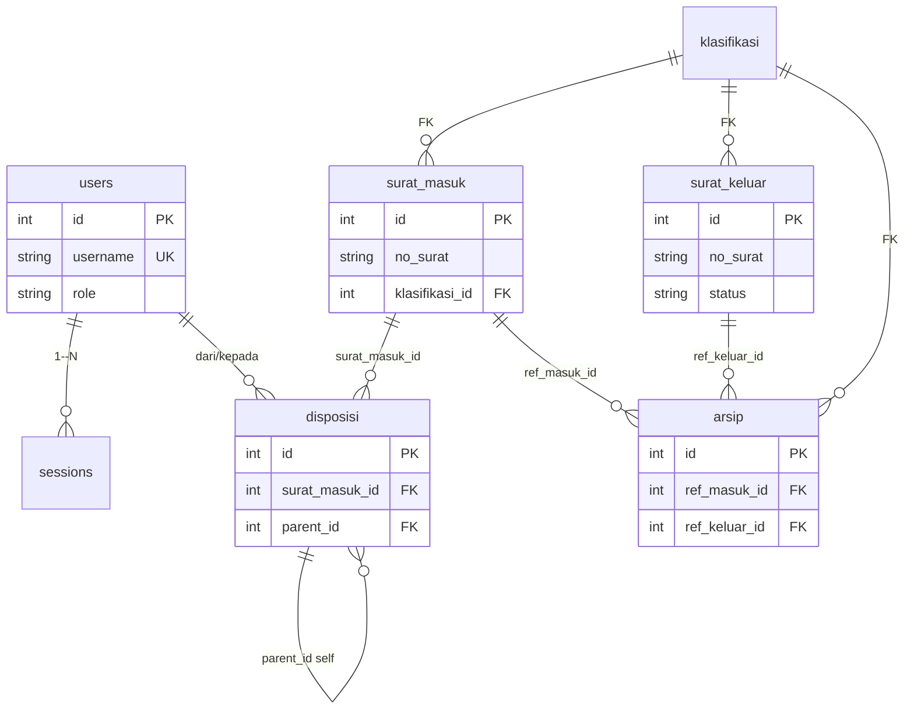
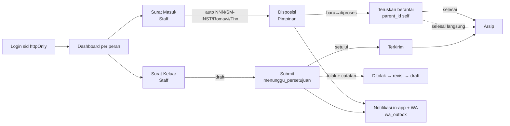

# SIPERSA — Konteks untuk Agent AI

> Sistem Persuratan (Surat Masuk/Keluar, Disposisi, Arsip) — UPTD Tekkomdik
> Stack: Nuxt 4 + Nitro + Turso/SQLite + Dropbox

Dokumen ini ringkasan dasar untuk agent AI. Untuk detail lengkap lihat `PLAN.md`, `AGENTS.md`, `server/utils/migrate.ts`.

## 1. Stack & Struktur

| Lapisan | Tech | Lokasi |
|---|---|---|
| Client | Nuxt 4, Vue 3 + TS, Nuxt UI v4, Tailwind v4, TinyMCE, Uppy, Chart.js | `app/` |
| Server | Nitro, 70+ endpoint `server/api/**`, cookie `sid` httpOnly | `server/` |
| Storage | Turso `@libsql/client` (`.data/local.db`), Dropbox (`file_drive_id`) | `server/utils/db.ts`, `server/utils/dropbox.ts` |
| Validasi | Zod | `lib/validations.ts` |

Config: `nuxt.config.ts` (`bodySize 25MB`, `routeRules /api/** csr:false`).

## 2. ERD (Ringkas)

> 12 tabel aktual di `server/utils/migrate.ts`. Di bawah 7 inti untuk gambaran AI.



Lainnya: `surat_keluar_approval`, `notifications`, `activity_log`, `wa_outbox`, `wa_inbound`. Soft delete via `deleted_at IS NULL`, file via `file_drive_id` (Dropbox).

## 3. Arsitektur

```
[app/ Vue] --HTTPS/JSON--> [Nitro server/api + middleware/auth] --> [Turso/SQLite + Dropbox]
```

- Auth: `sid` httpOnly, tabel `sessions` (`revoked`, `expires_at`)
- Upload: `multipart/form-data` → `readFormWithFile()` → Dropbox `/Surat Masuk|Keluar|Arsip`
- Nomor otomatis: `server/utils/no.ts` → `NNN/SM-INST/Romawi/Tahun` (masuk), `KODE/NNN/TU/tekkomdik/Romawi/Tahun` (keluar), reset tahunan `MAX(no_urut)+1`

## 4. Alur

### 4.1 Diagram Alur



### 4.2 Surat Masuk (Staff)

- Input: `tgl_surat`, `tgl_terima`, `pengirim`, `perihal`, `klasifikasi_id` FK, `sifat`/`status`, file pindaian
- Upload: `multipart/form-data` → `readFormWithFile()` (`server/utils/body.ts`) → Dropbox `/Surat Masuk` → simpan `file_drive_id`/`file_name`
- Nomor: `NNN/SM-INST/<RomawiBulan>/<Tahun>` via `server/utils/no.ts` (`MAX(no_urut)+1` per tahun)
- Status: `diterima` → `didisposisikan` → `ditindaklanjuti` → `selesai`

### 4.3 Disposisi (Pimpinan ↔ Staff)

- Buat: `dari_user_id` → `kepada_user_ids[]` + `instruksi_list`, `sifat_disposisi`, `prioritas` (`normal`), `batas_waktu`, `notify` (`lib/validations.ts:40`)
- Chain: `parent_id` self-reference (`server/utils/migrate.ts:108`) — teruskan ke staff lain tercatat (`server/api/disposisi/[id]/teruskan.post.ts`)
- State: `baru` → `diproses` (`diproses_at`) → `selesai` (`selesai_at`), bisa selesai langsung tanpa teruskan
- Notifikasi: in-app `notifications` + WA `wa_outbox` (Fonnte) ke `kepada_user_id`

### 4.4 Surat Keluar (Staff ajukan, Pimpinan approve)

- Tulis: `tgl_surat`, `tujuan`, `perihal`, `klasifikasi_kode`, `penandatangan_id` FK users, `html_content` (TinyMCE) / upload file
- Alur: `draft` → `menunggu_persetujuan` (submit `server/api/surat-keluar/[id]/submit.post.ts`) → `terkirim` / `ditolak` (approve `server/api/surat-keluar/[id]/approve.post.ts` + `catatan_tolak`)
- Ditolak → revisi → kembali `draft` → ajukan ulang

### 4.5 Arsip & Laporan

- Arsipkan: 1 surat = 1 arsip (`ref_masuk_id`/`ref_keluar_id` nullable) + `klasifikasi_id`, `tgl_arsip`, `retensi_tahun`
- Soft delete: `deleted_at IS NULL` di list, restore `server/api/arsip/[id]/restore.post.ts`, musnah `destroy.post.ts`
- Laporan: export Excel `server/api/laporan/export.post.ts` (exceljs), cetak PDF `app/pages/laporan/cetak.vue` (`window.print`)

Rujukan: `docs/sop-alur-lengkap.mmd`, `docs/diagram/flowchart.mmd`, `docs/diagram/penomoran.mmd`.

## 5. Peran & Fitur

| Peran | Hak |
|---|---|
| **admin** | Users, Klasifikasi, Sesi, Activity Log, Restore Arsip, Laporan |
| **staff** | Surat Masuk/Keluar (buat/ajukan), Disposisi inbox, Arsip aktif |
| **pimpinan** | Kelola Disposisi, Approve/Reject Surat Keluar, Monitoring batas_waktu |

Fitur kunci: Dashboard 8 KPI, Disposisi teruskan berantai + notifikasi in-app/WA, Preview file `/api/files/[id]`, Export Excel (exceljs) / Print PDF, Search global, Log aktivitas.
